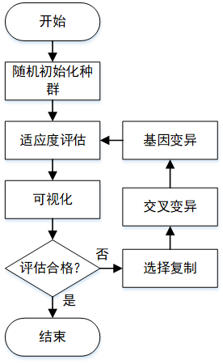
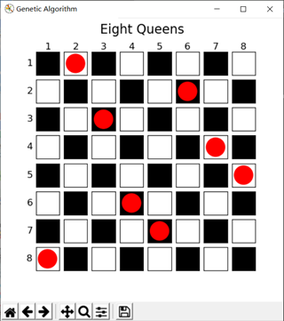
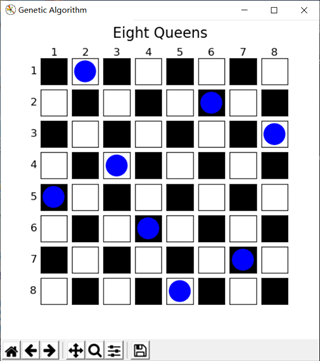

#遗传算法解决八皇后问题示例

##问题描述
在8x8网格中搜索8个位置放置棋子，要求每枚棋子所在行与列，以及斜对角线上均没有其它棋子。

##设计方法
使用经典的遗传算法对问题进行搜索求解。主要的设计部分包括：染色体编码、适应度函数、选择复制、交叉变异和基因变异。

###染色体编码的设计
遗传算法的编码方法有二进制编码和位置编码等。在八皇后问题中，考虑到不需要浮点计算，且有明确的位置限制。为简化搜索空间，使用位置编码方法以限制每行每列只允许有一枚棋子。也就是说，编码后的染色体中不允许有重复的基因。具体编码过程的解释如下：
每条染色体包含8个基因，每个基因的取值范围为[0, 7]（即棋盘网格的列索引），且一条染色体中的基因不允许重复。如染色体A=[0, 1, 2, 3, 4, 5, 6, 7]，那么A中染色体x在网格中的坐标（个体表现型）为[k, A[k]]，k表示基因x在A中的位置索引。

###适应度函数的设计
考虑到问题的明确位置限制，因此个体适应度评估方法为统计染色体中无位置冲突的基因对的总数，即染色体中任意一对基因的表现型无位置冲突的总数。由于一条染色体有8个基因，共有28对组合，因此适应度函数的最大值为28，当在迭代中个体适应度达到28时即表示已经搜索到目标位置。

###选择复制的设计
遗传算法中常见的选择复制方法有轮盘法和竞赛法等。考虑到问题中适应度函数的取值基本相差不大，采用轮盘法容易导致个体多样性下降，从而算法的收敛速度减缓。因此使用竞赛法对种群中的个体进行选择。竞赛法的描述如下：
从种群中随机挑选N个个体进行比赛，个体适应度最大的个体得以复制到下一代。每次竞赛选出一个最优个体，重复选择直到种群数量满足要求。

###交叉变异的设计
在八皇后问题中，由于有严格的位置限制，且采用位置编码的形式，使用传统的交叉方法会导致组合后的基因出现重复。经过观察后发现，在基因不允许重复的情况下进行交叉就等价于个体染色体自身的乱序排列。因此采用特殊设计的交叉方法，方法描述如下：
在群体中随机挑选出两个个体进行交叉变异，接着在[0, 7]范围内生成两个不重复的随机数a和b（a < b），然后以a, b为界，将选出的两个个体的染色体中[a, b]范围内的基因打乱顺序，即达到交叉变异的目的。

###基因变异的设计
因染色体中的基因不允许重复，故传统的单点变异或多点变异方法不可取。采用基因调换的方式进行变异，即随机将染色体中的两个基因进行调换位置，以达到基因变异的目的，同时也不会导致染色体出现基因重复。

##运行环境搭建
设计使用Python语言完成，运行脚本需要构建Python的运行环境（如已经具备则跳过）。
下载安装Python3.x.x，推荐Python3.6.3版本，推荐使用Anaconda3。执行命令安装以下包:
```python
pip install argparse
pip install numpy
pip install matplotlib
```

##运行及参数设置
输入以下命令直接运行默认参数：
```python
python genetic_algorithm.py
```
默认的运行参数为：--unities=16, --p_crossover=0.5, --p_mutate=0.05, --iterations=100； 即种群中个体数为16，个体交叉变异的概率为0.5，基因变异的概率为0.05以及算法迭代的次数为100次。
如需使用自定义运行参数，可在运行脚本时指定。例如设置个体为32，交叉变异概率为0.25，基因变异概率为0.025，算法迭代次数为50次，可输入如下：
```python
python genetic_algorithm.py -- unities=32 \
--p_crossover=0.25 \
--p_mutate=0.025 \
--iterations=50
```

##程序流程图


##运行截图展示



